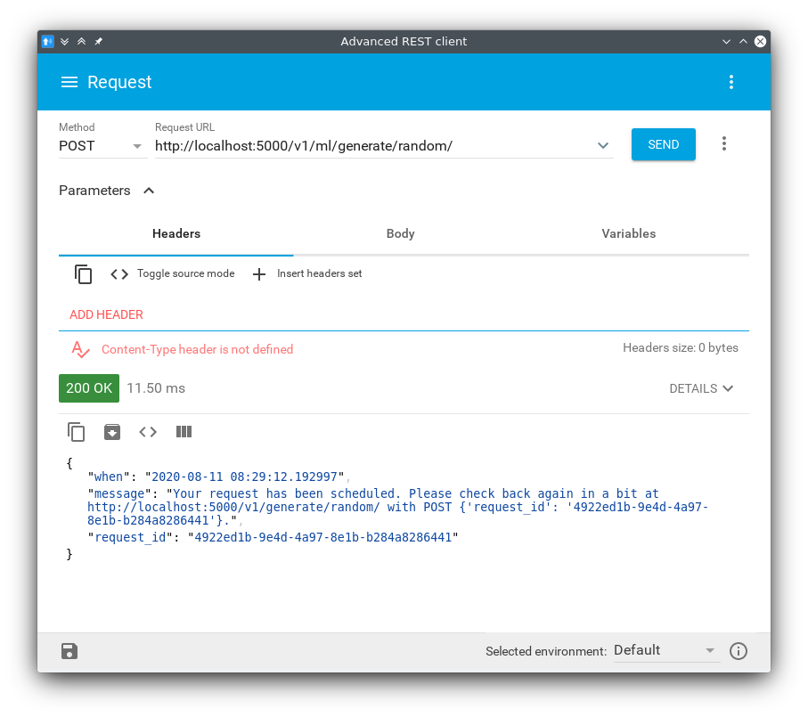
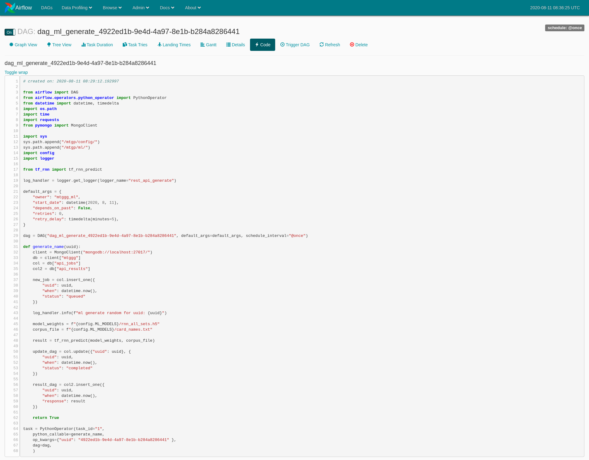
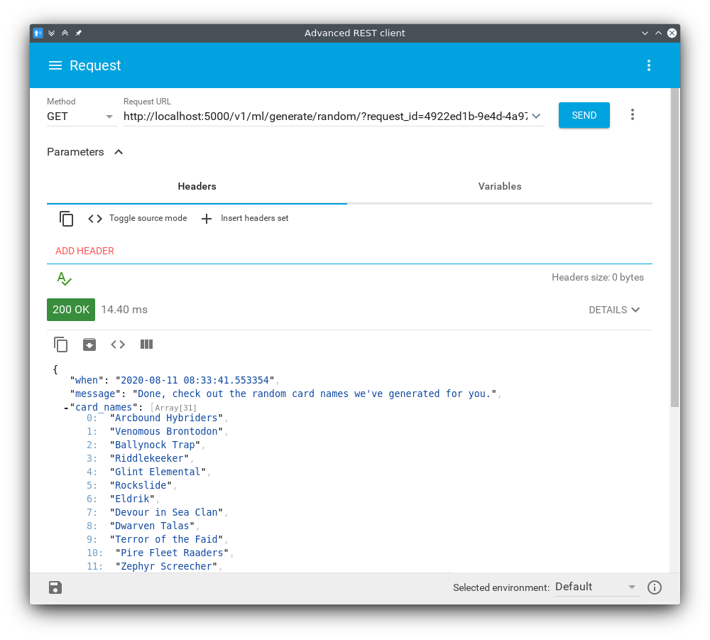

```
mtggg - mtg good game
```

#### Source code

The subdirectory `project/` facilitates all the files (python, jupyter notebooks, metaflow flows, and shell scripts) needed to:

a. Fetch the dataset.

b. Preprocess, transform and extract features from the dataset.

c. Store the artifacts in Parquet, MongoDB and ElasticSearch.

Furthermore, there are two applications, one in Flask-RESTful for serving the REST API and another one, in Flask for serving the experimnetal dynamic website.

#### Vagrant image

In the subdirectory `Vagrant/` you may find all the relevant files to setup a virtual machine to run the project. Currently it's under heavy development. Only the bare minimum files are created.

#### Screenshots

1. REST API - Generate random card name

    Below is an example of the current REST pipeline the project has. The specific pipeline showcases the intermediate steps to generate a novel card name using a deep neural network.

    First the user makes a `POST` request; which results in creating a new DAG with all the necessary code to load a pretrained DNN model and generate a new card name.

    

    The DAG is scheduled and the results are passed to MongoDB.

    

    Later, the user may do a `GET` request with a specific `request_id` (as provided from the previous step) and fetch the results in a JSON format.

    
